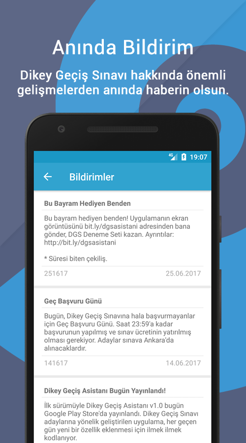

<h1 align="center"> Dikey Geçiş Asistanı</h1>

Dikey Geçiş Asistanı is **an Android (native) application** developed for students preparing for the Vertical Transfer Exam (Dikey Geçiş Sınavı) in Turkey. The application, which was last updated on Nov 15, 2019, falls under the Education category and can be classified as a personal assistant, study guide, and test preparation app.

## Features
With Dikey Gecis Asistani, you can:
- Calculate your current DGS score
- Chat with other DGS candidates
- Share your score with others
- View all DGS dates
- Save your trial exam results
- Calculate your associate degree success score
- View offline summaries of math, Turkish, and geometry topics
- Save the number of questions you have solved
- Mark the topics you have completed
- Create a personalized profile screen
- Receive instant notifications about DGS
- View past notifications about DGS
- Exam timer
- LCM and GCD calculator

## Screenshots

| 1 | 2 | 3 |
| -------- | -------- | -------- |
|  |  |  |

| 4 | 5 | 6 |
| -------- | -------- | -------- |
|  |  |  |

| 7 | 8 | 9 |
| -------- | -------- | -------- |
|  |  |  |

| 10 | 11 |
| -------- | -------- | 
|  |  | 

## Version and Category
- **Application Name:** Dikey Geçiş Asistanı
- **Description:** A guidance application for students preparing for the Vertical Transfer Exam.
- **Latest Version:** 2.0.4 (Nov 15, 2019)
- **Category:** Education
- **Tags:** Education, Personal assistant, Study guide, Test preparation
- **App, or Game:** App
- **minSdkVersion:** 14
- **targetSdkVersion:** 25
- **compileSdkVersion:** 25

## Permissions
Dikey Gecis Asistani requires the following permissions:
- Prevent device from sleeping: To keep track of the exam timer screen.
- Internet access: For instant notifications and membership transactions.

## Built with
- Android Studio
- Java
- Firebase

## License
Dikey Gecis Asistani is an open-source project licensed under the MIT License. See [the LICENSE file](LICENSE) for details.